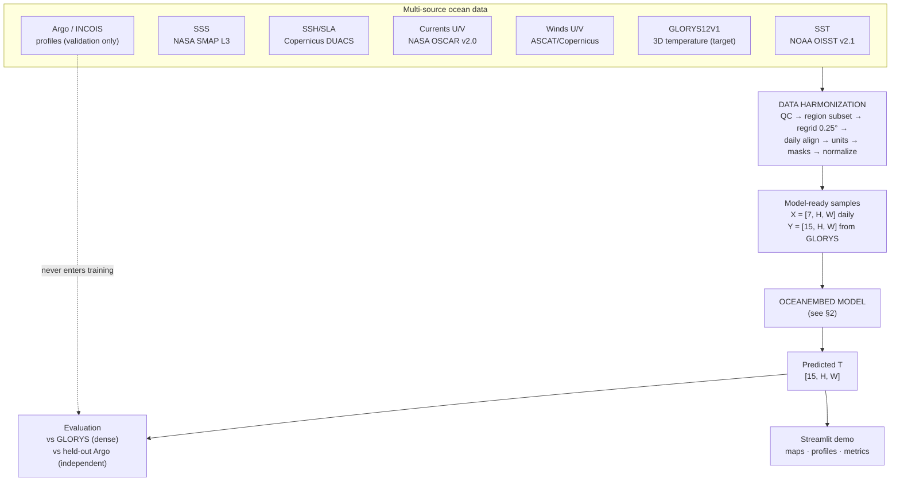
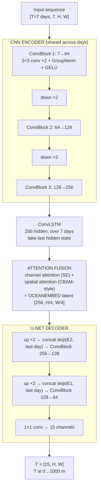
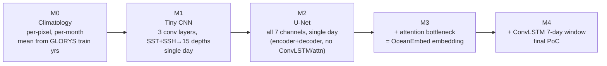

# 03 — System & Model Architecture

## 1. End-to-end system

## 2. OceanEmbed model (M4, final PoC form)

### Design rationale (each choice is cited in doc 02)

| Component | Choice | Why |
|---|---|---|
| Backbone | CNN, not ViT | CNN beats Transformer at this data scale; local features (fronts/eddies) dominate the task |
| Norm | GroupNorm, not BatchNorm | Small batches on 16–24 GB GPUs; ocean fields have region-dependent stats |
| Temporal | ConvLSTM on encoder features (not raw fields) | Cheaper; DORS proved ConvLSTM for this task; preserves map structure vs plain LSTM |
| Attention | SE channel + spatial attention at the bottleneck | EBAM-CNN and 3D-U-Net++ both show attention-in-CNN wins in this exact task; this IS the "embedding engine" the PS asks for |
| Decoder | U-Net skips from the **last day's** encoder features | Skip connections preserve spatial detail; last day is the prediction date |
| Output head | 15 channels, one per SIH depth | Map-to-map, matches PS deliverable exactly; avoids 3D convs (heavier, no proven gain — OceanDepths: 2D U-Net ≥ 3D U-Net) |
| Masking | Land + missing masks multiply the loss | Never scored on land; missing satellite pixels don't poison gradients |

### Tensor shapes at 0.25° over the PoC region

Region (freeze once confirmed): **lat 0–25°N, lon 55–100°E** → H=100, W=180. Pad/crop to **H=96, W=176** (divisible by 4 for two downsamplings) or train on 96×96 random crops and infer full-field (fully convolutional — both work; crops give data augmentation for free).

| Tensor | Shape | ~Size (fp32) |
|---|---|---|
| One day X | [7, 96, 176] | 0.45 MB |
| Sequence input | [7, 7, 96, 176] | 3.2 MB |
| Target Y | [15, 96, 176] | 1.0 MB |
| Model params (est.) | ~8–15 M | 60 MB |

**Conclusion: this comfortably trains on a free Kaggle T4.** Batch 16 sequences ≈ a few GB of activations. No excuse to buy compute before M4.

## 3. Progressive builds (what each M-stage actually is)

Rule: each stage must beat the previous on the **same validation year, same metrics**, or we stop and debug before adding the next component. The ablation table this produces is itself a presentation deliverable.

## 4. Component specs (implementation reference)

### ConvBlock
`Conv3×3 → GroupNorm(8) → GELU → Conv3×3 → GroupNorm(8) → GELU`, padding=1. Downsample via stride-2 conv (not maxpool — learnable, standard in modern U-Nets).

### ConvLSTM cell
Standard Shi et al. 2015 formulation: gates computed by convolutions over `[h, x]` concat. One layer, hidden=256, kernel 3×3. Input: sequence of encoder bottleneck features `[B, T, 256, H/4, W/4]`. Output: last hidden state. (M4 only; in M2/M3 the bottleneck features pass straight through.)

### Attention fusion (OceanEmbed core)
1. **Channel attention (SE):** global-avg-pool → FC(256→16) → GELU → FC(16→256) → sigmoid → scale channels. Learns which surface variables' features matter.
2. **Spatial attention:** channel-wise mean+max → concat → 7×7 conv → sigmoid → scale positions. Learns *where* (eddies, fronts) to focus.
Applied sequentially (CBAM order). The output feature map is what we call the OceanEmbed representation; it is also what we visualize for the demo "embedding view" (PCA of channels → RGB).

### Inference
Full-region single forward pass, ~milliseconds on CPU. The demo needs **no GPU**.

## 5. What we deliberately did NOT include

- **Salinity output** — PS asks for temperature only; adding S doubles the target pipeline. Trivial extension later (head 15→30 channels), say so if asked.
- **Physics-informed loss** (e.g., stratification constraints) — documented upgrade path (Zhao et al. 2025), not needed to win the internal round.
- **3D convolutions, ViT, GNN, diffusion** — see doc 02 §1; complexity without evidence of gain at our data scale.
- **Uncertainty estimation** — MC-dropout is a one-line flex if there's time; not a milestone.
