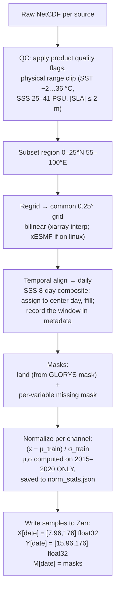

# 04 — Data: Sources, Access, and Preprocessing Pipeline

## 1. Source products (frozen list)

| # | Variable | Product | Native res. | Access | Account |
|---|---|---|---|---|---|
| 1 | SST | NOAA OISST v2.1 | 0.25°, daily | HTTPS/THREDDS from NCEI, plain NetCDF | none |
| 2 | SSS | NASA SMAP RSS L3 8-day running mean v4 | 0.25° | PO.DAAC (`podaac-data-subscriber` or HTTPS) | NASA Earthdata (free) |
| 3 | SSH/SLA (ADT) | Copernicus DUACS L4 `SEALEVEL_GLO_PHY_L4_MY_008_047` | 0.125°, daily | `copernicusmarine` client | CMEMS (free) |
| 4–5 | Currents U/V | NASA OSCAR v2.0 final | 0.25°, daily | PO.DAAC | Earthdata |
| 6–7 | Winds U/V | Copernicus `WIND_GLO_PHY_L4` (or ASCAT L4) | 0.125–0.25° | `copernicusmarine` | CMEMS |
| Target | 3D Temperature | GLORYS12V1 `GLOBAL_MULTIYEAR_PHY_001_030`, var `thetao` | 1/12°, daily, 50 levels | `copernicusmarine` | CMEMS |
| Validation | Argo T profiles | Argo GDAC via `argopy` (or INCOIS mirror) | point | `pip install argopy` | none |
| Bootstrap | Everything above, pre-paired | **ESA OceanDepths** (HF `ESA-philab/OceanDepths`) | 0.1°, weekly | `huggingface_hub` | none |

**Register both accounts (Earthdata + Copernicus Marine) on day 1.** Credentials in `~/.netrc` / `copernicusmarine login`, never in git.

### Download example (GLORYS, our region)

```python
import copernicusmarine
copernicusmarine.subset(
    dataset_id="cmems_mod_glo_phy_my_0.083deg_P1D-m",
    variables=["thetao"],
    minimum_longitude=55, maximum_longitude=100,
    minimum_latitude=0,  maximum_latitude=25,
    start_datetime="2015-01-01", end_datetime="2022-12-31",
    minimum_depth=0, maximum_depth=1100,
    output_filename="glorys_nio.nc",
)
```

Size control: our region at 1/12° × 35 levels (≤1100 m) × daily is large — download **year by year**, immediately regrid+interp to the 15 SIH depths at 0.25°, keep only the processed Zarr, delete raw. Budget ~2–5 GB processed for 8 years.

## 2. Region and period (freeze these)

- **Bounding box:** 0–25°N, 55–100°E (Arabian Sea + Bay of Bengal + eq. Indian Ocean). At 0.25°: 100×180 → pad to **96×176 model grid**.
- **Period:** 2015–2022 (SMAP SSS starts April 2015 — the binding constraint). ~2,800 daily samples.
- **Split (time-based, non-negotiable):** train 2015–2020 · validation 2021 · test 2022. Argo profiles from 2021–2022 in the region = independent evaluation set.

## 3. The 15 SIH depth levels

`0, 5, 10, 20, 30, 50, 75, 100, 125, 150, 200, 300, 500, 700, 1000 m` — linear interpolation of GLORYS's 50 native levels onto these (xarray `interp` on the depth coordinate). Same interpolation applied to Argo profiles at evaluation time (only within a profile's observed depth range; no extrapolation — mirror the OceanDepths acceptance rule: reject a level if the nearest observed depth is farther than `max(0.1·z, 10 m)`).

## 4. Preprocessing pipeline (stage by stage)



Implementation notes:

- One script per source in `src/download/`, one harmonizer in `src/preprocess/` — each idempotent (skip if output exists) so pipeline reruns are cheap.
- Missing satellite pixels: fill with 0 **after** normalization (i.e., the mean) and pass the missing mask; the loss also ignores masked *target* cells. Do not interpolate over data gaps silently.
- Store everything as one Zarr store `data/processed/nio_daily.zarr` with dims `(time, channel, y, x)` — random access by date is O(1), works identically on Kaggle after upload as a Kaggle Dataset.
- The `Dataset.__getitem__` for M4 returns `(X[t−6…t], Y[t], M[t])`; for M1–M3 just `(X[t], Y[t], M[t])`.

## 5. Bay of Bengal gotchas (know these for Q&A)

- **Barrier layer:** massive river discharge (Ganga-Brahmaputra) creates a shallow salinity-stratified layer that decouples SST from subsurface heat — this is *why* SSS is a critical input here, and a great answer to "why 7 variables?".
- **SMAP SSS near coasts** is noisy/land-contaminated within ~40 km of the coast — expect a degraded coastal ring; the missing/quality mask handles it, mention it as a known limitation.
- **Monsoon seasonality** dominates variance — this is why climatology (M0) will look strong, and why we report anomaly correlation, not just RMSE.
- **Argo density** in the region is decent (INCOIS is a major Argo player) but sparser near coasts and in the northern Bay.

## 6. OceanDepths bootstrap path (week 1, before our pipeline exists)

```
pip install huggingface_hub
# pull a few Indian Ocean patches + the provided DataLoader code
```
Use its 128×128 patches (SST/SSS/ADT + GLORYS cube + EN4 profiles, eval year 2018) to: (1) run M0 and M1 end-to-end, (2) validate our training loop and metrics code against their published baseline numbers (climatology RMSE ≈ 0.97 °C — if our M0 code reproduces that, our metrics code is correct). Then swap in our own 7-channel daily pipeline for M2+.
