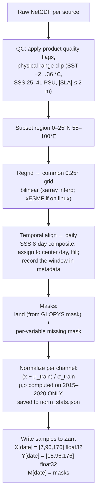

# 04 — Data: Sources, Access, and Preprocessing Pipeline

## 1. Source products (frozen list)

| # | Variable | Product | Native res. | Access | Account |
|---|---|---|---|---|---|
| 1 | SST | NOAA OISST v2.1 | 0.25°, daily | HTTPS/THREDDS from NCEI, plain NetCDF | none |
| 2 | SSS | NASA SMAP RSS L3 SSS **v6**, 8-day running mean (v4 retired at 2022-07-11) | 0.25°, **8-day running mean** (not daily), from **2015-03-27** | PO.DAAC (`podaac-data-subscriber` or HTTPS) | NASA Earthdata (free) |
| 3 | SSH/SLA (ADT) | Copernicus DUACS L4 `SEALEVEL_GLO_PHY_L4_MY_008_047` | 0.125°, daily | `copernicusmarine` client | CMEMS (free) |
| 4–5 | Currents U/V | NASA OSCAR v2.0 final — use variables **`u`,`v`** (total current), *not* `ug`,`vg` (geostrophic-only) | 0.25°, daily, 1993 → 2026 | PO.DAAC | Earthdata |
| 6–7 | Winds U/V | Copernicus **`WIND_GLO_PHY_L3_MY_012_005`** — *Global Ocean Daily Gridded Reprocessed L3 Sea Surface Winds from Scatterometer* | **0.125°, daily**, covers 1991-08 → 2026-04 | `copernicusmarine` | CMEMS |
| Target | 3D Temperature | **GLORYS12V1** `GLOBAL_MULTIYEAR_PHY_001_030`, var `thetao` — *PS-named,* [`doi:10.48670/moi-00021`](https://doi.org/10.48670/moi-00021) | 1/12°, daily, 50 levels | `copernicusmarine` | CMEMS |
| Validation B1 | Gridded Argo T | **INCOIS Live Access Server (LAS) Gridded ARGO** — *PS-named* | **1°×1°, 10-day & monthly** (objective analysis) | [INCOIS LAS](https://incois.gov.in/site/dataholdings.jsp) OPeNDAP/THREDDS | none |
| Validation B2 | Raw Argo T profiles | Argo GDAC via `argopy` (or EN4) | point, ~10-day cycle | `pip install argopy` | none |
| Bootstrap | Everything above, pre-paired | **ESA OceanDepths** (HF `ESA-philab/OceanDepths`) | 0.1°, weekly | `huggingface_hub` | none |

**On the two validation tracks.** The PS names INCOIS LAS **Gridded** ARGO, so B1 is mandatory for compliance and is the product INCOIS itself operates on. But it is an *objectively-analysed* field (DIVA/OI-interpolated onto 1°, 10-day) — it has already been smoothed, and at 1° it is 4× coarser than our output, so it cannot test our full resolution and it partly shares the smoothing character of a reanalysis. B2 (raw profiles at their true lat/lon/time) is therefore the stricter test and the better scientific story. Run both; the metric code is identical, only the matching step differs. If the two disagree, that difference is itself a result worth showing (it quantifies what objective analysis smooths away).

**Wind product — verified, and a caveat.** `WIND_GLO_PHY_L3_MY_012_005` is the right choice: daily, gridded, reprocessed multi-year, spans our whole 2015–2022 period, and provides eastward/northward wind directly. Two things to handle on first download:

- It is **0.125°**, not 0.25° — regrid down to our target grid (permitted by PS req. 7).
- Ascending and descending satellite passes are **gridded as separate fields**. A single scatterometer does not see the whole globe every day, so expect swath gaps; combine the passes and let the missing-mask carry whatever is still empty. **Measure the actual daily gap fraction over our box before committing** — if it is severe, fall back to `WIND_GLO_PHY_L4_MY_012_006` (hourly, scatterometer+model blended, gap-free) averaged to daily, and document that it is model-blended rather than pure observation.

**Register both accounts (Earthdata + Copernicus Marine) on day 1.** Credentials in `~/.netrc` / `copernicusmarine login`, never in git. INCOIS LAS and Argo GDAC need no account.

> **PS requirement 7 sanctions all of this regridding:** *"If a dataset is not available at required resolution, the team may select the openly available product and perform appropriate spatial and temporal interpolation/regridding."* Every interpolation below is therefore a documented, permitted choice — record the method used for each product so it can be stated in the report.

### Download example (GLORYS, our region)

```python
import copernicusmarine
copernicusmarine.subset(
    dataset_id="cmems_mod_glo_phy_my_0.083deg_P1D-m",
    variables=["thetao"],
    minimum_longitude=55, maximum_longitude=100,
    minimum_latitude=0,  maximum_latitude=25,
    start_datetime="2015-01-01", end_datetime="2022-12-31",
    minimum_depth=0, maximum_depth=1100,
    output_filename="glorys_nio.nc",
)
```

Size control: our region at 1/12° × 35 levels (≤1100 m) × daily is large — download **year by year**, immediately regrid+interp to the 15 SIH depths at 0.25°, keep only the processed Zarr, delete raw. Budget ~2–5 GB processed for 8 years.

## 2. Region and period (freeze these)

- **Bounding box:** 0–25°N, 55–100°E (Arabian Sea + Bay of Bengal + eq. Indian Ocean). At 0.25°: 100×180 → pad to **96×176 model grid**.
- **Period:** 2015-04-01 → 2024-12-31, ~3,560 daily samples. **SMAP SSS begins 2015-03-27** — the binding constraint on the *start*; 2015-04-01 gives a clean month boundary. The end was originally 2022 because SMAP SSS **V4** was retired at 2022-07-11 (which would have left the validation year half empty); **we use V6**, current to the present. OSCAR reaches 2026-01 and GLORYS12V1 daily 1993-01-01 → 2026-06-23, so nothing but download time limits the end.
- **Split (time-based, non-negotiable):** train 2015–2021 · validation 2022 · test 2023–2024. Argo profiles from 2022–2024 in the region = independent evaluation set.

## 3. The 15 SIH depth levels

`0, 5, 10, 20, 30, 50, 75, 100, 125, 150, 200, 300, 500, 700, 1000 m` — linear interpolation of GLORYS's 50 native levels onto these (xarray `interp` on the depth coordinate). Same interpolation applied to Argo profiles at evaluation time (only within a profile's observed depth range; no extrapolation — mirror the OceanDepths acceptance rule: reject a level if the nearest observed depth is farther than `max(0.1·z, 10 m)`).

## 4. Preprocessing pipeline (stage by stage)



Implementation notes:

- One script per source in `src/download/`, one harmonizer in `src/preprocess/` — each idempotent (skip if output exists) so pipeline reruns are cheap.
- Missing satellite pixels: fill with 0 **after** normalization (i.e., the mean) and pass the missing mask; the loss also ignores masked *target* cells. Do not interpolate over data gaps silently.
- Store everything as one Zarr store `data/processed/nio_daily.zarr` with dims `(time, channel, y, x)` — random access by date is O(1), works identically on Kaggle after upload as a Kaggle Dataset.
- The `Dataset.__getitem__` for M4 returns `(X[t−6…t], Y[t], M[t])`; for M1–M3 just `(X[t], Y[t], M[t])`.

**Store schema (frozen, implemented in `src/datasets.py`):** two arrays in `data/processed/nio_daily.zarr` — `X (time, channel, y, x)` and `Y (time, depth, y, x)`, both float32, with coords `time, channel, depth, lat, lon`. **NaN is the mask** — there are no separate mask arrays to keep in sync. Land and missing cells are NaN in the store; `NIODataset.__getitem__` replaces NaN in the inputs with 0 *after* normalisation (i.e. the train mean) and returns `np.isfinite(Y)` as the boolean target mask that the loss and the metrics both honour. Normalisation stats live in `data/processed/norm_stats.json`, computed on the train split only.

## 5. Bay of Bengal gotchas (know these for Q&A)

- **Barrier layer:** massive river discharge (Ganga-Brahmaputra) creates a shallow salinity-stratified layer that decouples SST from subsurface heat — this is *why* SSS is a critical input here, and a great answer to "why 7 variables?".
- **SMAP SSS near coasts** is noisy/land-contaminated within ~40 km of the coast — expect a degraded coastal ring; the missing/quality mask handles it, mention it as a known limitation.
- **Monsoon seasonality** dominates variance — this is why climatology (M0) will look strong, and why we report anomaly correlation, not just RMSE.
- **Argo density** in the region is decent (INCOIS is a major Argo player) but sparser near coasts and in the northern Bay.
- **OSCAR currents are a 0–30 m average**, not a true skin-layer current. Harmless for us (the mixed layer is what carries subsurface signal) but state it accurately — do not call it "surface current" in the report without the qualifier.
- **SMAP is an 8-day running mean, not a daily field.** It is the only non-daily input. Assign each composite to its centre date and forward-fill; record the window in the Zarr metadata so the temporal smoothing is auditable. Expect it to limit how sharp a day-to-day signal the model can learn from salinity.

- **Argo profile counts in our box.** The OceanDepths `indices/profiles.parquet` index (EN4-derived) suggested ~2,089 profiles in 2021 and 4,022 in 2022. The direct Ifremer ERDDAP GDAC query used by `src/download/argo.py` actually returns **7,865 profiles / 3.08M good-QC levels** for 2021-2022 in 0-25N/55-100E, because it includes real-time floats the EN4 index does not. After the acceptance rule, ~87% of profiles yield a usable 0 m value and ~72% reach all 15 depths, so the independent evaluation set is a few thousand full profiles -- enough for depth-wise metrics, not enough to slice finely by season *and* sub-region at once.

## 6. OceanDepths bootstrap path (week 1, before our pipeline exists)

```
pip install huggingface_hub
# pull a few Indian Ocean patches + the provided DataLoader code
```
Use its 128×128 patches (SST/SSS/ADT + GLORYS cube + EN4 profiles, eval year 2018) to: (1) run M0 and M1 end-to-end, (2) validate our training loop and metrics code against their published baseline numbers (climatology RMSE ≈ 0.97 °C — if our M0 code reproduces that, our metrics code is correct). Then swap in our own 7-channel daily pipeline for M2+.
