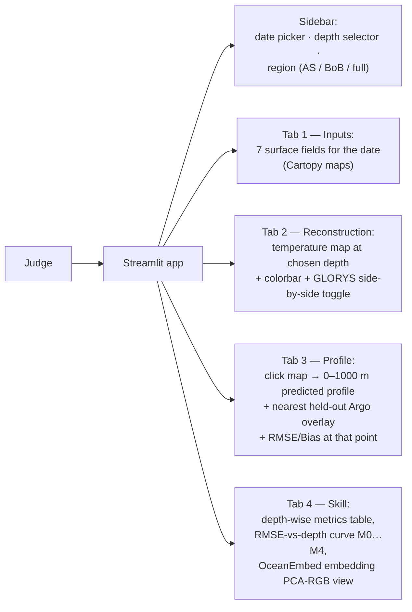

# 06 — Demo Spec, Roadmap, Risks

## 1. Streamlit demo (what the judge does)

> **Built.** `streamlit run app/streamlit_app.py` — see [`app/README.md`](https://github.com/swaraj-shubh/OceanEmbed/blob/main/app/README.md)
> for the 90-second demo path. The spec below is what was implemented, with two deliberate
> deviations recorded in the implementation rules.

Implementation rules:

- **Fully offline.** Loads the frozen model + the processed Zarr + a precomputed Argo evaluation parquet. No internet at demo time (venue Wi-Fi always fails).
- **The frozen model is six checkpoints plus a JSON offset**, not one file — see `results/FROZEN.md`. Cheapest path for the demo: ship the *precomputed prediction cubes* (`results/ens_mix6_{val,test}_cube.nc`, already bias-corrected) rather than running six forward passes per click. A click then becomes an array lookup, and the app needs no torch at all. Keep a single-checkpoint live-inference path only if a judge asks to see it predict a date that isn't precomputed.
- Inference is a CPU forward pass (<1 s full region). Precompute nothing that a click can compute; precompute everything that needs the pipeline (all inputs/targets for the demo date range shipped in the Zarr).
- `streamlit` + `plotly` for interactive maps (`st.plotly_chart` with clickable heatmap → profile).
- Keep a 90-second scripted demo path: pick a cyclone-season date in the Bay of Bengal → show depth-100 m map → click the eddy → profile matches Argo → skill tab. Rehearse it.

**Two deliberate deviations from the spec above, as built:**

1. **No cartopy.** The spec called for `matplotlib+cartopy` coastlines in Tab 1. The land mask is already implicit in the data — prediction cubes carry NaN on every cell the model was never supervised on — so plotly renders coastlines from our own arrays for free. Cartopy is the hardest dependency in the stack to install on Windows and the one most likely to break a Streamlit Cloud build, and dropping it leaves the app needing just seven packages, **none of them torch**.
2. **No PCA-RGB embedding view in Tab 4.** Marked "optional flex" in CLAUDE.md §9. It would put torch and a checkpoint back into the demo purely for a panel most judges cannot interpret, so it is skipped rather than shipped half-explained. Everything else in the spec is implemented.

**Built as specified otherwise**, with two things worth knowing: the bundle covers the full test split — every predictable day, 2023-01-07 → 2024-12-31 (725 days), not a representative slice — chunked into 8 calendar-quarter files so no single tracked file exceeds GitHub's 100 MB limit, with `app/loader.py` loading only the quarter a click touches; and on-screen profile metrics import `src/argo_eval.interp_profile` rather than re-implementing the acceptance rule — so what a judge reads is the same measurement as the published tables, not a lookalike.

## 2. Roadmap (adjust dates to the internal round deadline)

| Week | Milestone | Definition of done |
|---|---|---|
| 1 | Environment + OceanDepths bootstrap | One patch loaded and visualized; both data accounts registered |
| 1–2 | M0 + M1 on OceanDepths | Our metrics code reproduces climatology RMSE ≈ 0.97 °C; tiny CNN trains |
| 2–3 | Own pipeline | `nio_daily.zarr` exists for 2015–2022; X/Y/M sample plots look physical |
| 3–4 | M2 (7-var U-Net) | Beats M0 on anomaly correlation at ≥ some depths |
| 4–5 | M3 (attention) + M4 (ConvLSTM) | Ablation rows filled. *Outcome: M4 best single model at 0.890; the shipped system is a 6-member ensemble + Argo bias correction at 0.786 — see [doc 10](10-experiment-programme.html)* |
| 5 | Argo Track-B evaluation | Headline depth-wise table vs independent Argo |
| 5–6 | Streamlit demo + freeze | Offline demo runs from checkout on a clean machine |
| 6 | Deck + rehearsal | 90-second demo path timed; Q&A prep from docs 01–05 |

Parallelize: one member owns pipeline (doc 04), one owns model/training (docs 03/05), one owns evaluation+Argo, one owns demo+deck. The Zarr contract (`X=[7,96,176]`, `Y=[15,96,176]`, masks) is the interface — agree on it first, then work independently.

## 3. Risks & mitigations

| Risk | Likelihood | Mitigation |
|---|---|---|
| Copernicus/PO.DAAC download slowness or quota | High | Start downloads week 1, year-by-year, process-and-delete; OceanDepths as fallback data |
| Model doesn't beat climatology | Medium | Expected at raw-RMSE for M1–M2 (doc 02 §2); the claim to win is anomaly correlation + thermocline-band RMSE; if even M4 fails, present honest ablation — methodological rigor still scores |
| Kaggle GPU quota binds late | Medium | Checkpoint/resume everywhere; ₹5–10k RunPod/AWS-Spot escape hatch |
| SMAP SSS gaps/coastal noise | Certain | Missing masks in loss; document as limitation, spin as "handling real observational sparsity" |
| Team pipeline/model integration breaks late | Medium | Freeze the Zarr tensor contract week 2; integration test = one end-to-end train step in CI-style script |
| Demo-day machine issues | Medium | Demo runs CPU-only from a `requirements.txt` + one `streamlit run` command; test on a second laptop; screen-record a backup video |

## 4. Q&A ammunition (one-liners)

- *Why not ViT/GNN (the PS mentions them)?* — A resource argument: with ~2,800 daily samples in one basin on a free T4, a convolutional backbone gives the most skill per unit of compute, and the structures that matter here (fronts, eddies, thermocline) are local. Attention is included where it demonstrably helps — as fusion inside the CNN, like EBAM-CNN and the attention 3D-U-Net++. GNNs suit irregular point data; our inputs are regular grids. **Do not say Transformers fail at this task** — DUViT does it well in the South China Sea; say a ViT is not the best use of *our* data and compute budget.
- *Why 7 variables?* — Bay of Bengal barrier layer: salinity stratification decouples SST from subsurface heat, so SSS/currents/winds carry real signal here; ablation SST-only vs 7-var quantifies it.
- *Isn't GLORYS circular with Argo?* — Partially; that's exactly why we hold out Argo and report anomaly correlation. Same protocol as OceanBench/NeurIPS benchmarks. Say it precisely: **the claim is bounded by the time split, not by product independence.** GLORYS assimilates Argo in general, so the two are not statistically independent; what is true and sufficient is that the model trains on GLORYS 2015–2021 only, so no 2023–24 Argo cast — nor the GLORYS state it informed — was ever seen in training. `python src/audit_leakage.py` prints exactly this, as check 7 of 8.
- ***"You fitted a correction on Argo, so your validation isn't independent anymore."*** — The sharpest question we get, and the answer is clean. **The network never sees Argo.** The correction is fifteen numbers — one mean residual per depth — fitted on the **2022 validation** year and applied unchanged to **2023–24 test**. The code refuses to fit on test (`bias_correct.py` asserts) and refuses to apply an offset fitted on the split being scored. It is reported as its own table row, never folded into the model's number, so the uncorrected 0.890 is always visible next to the corrected 0.786. This is standard model-output-statistics practice, and fifteen parameters against 6,056 held-out casts is not where overfitting lives.
- *Why is bias correction a contribution rather than a fudge?* — Because we **measured the thing being corrected**. GLORYS12V1 carries a +0.723 °C warm bias at 100 m in this basin against the same Argo casts, which is independently documented in the literature and acknowledged in Copernicus' own QUID (its internal bias correction is "fully effective under the thermocline, away from density gradients" — i.e. known not to fix this layer). Four architectural interventions failed to remove an error that was never the architecture's.
- *Your model beats GLORYS at some depths — how?* — At 125, 700 and 1000 m, yes. Not magic: the 0.728 "ceiling" bounds a model that only ever sees GLORYS. Once a correction fitted on independent observations is applied, the target's bias stops being inherited, so at depths where that bias dominates GLORYS' own error we pass it. Quote the ceiling as *"the bound for an uncorrected model"*.
- *How do you know your improvements aren't noise?* — Paired bootstrap, 1,000 resamples, **blocking by Argo float rather than by profile**: 6,448 test casts come from only 147 floats, so a naive profile-level bootstrap reports intervals ~6.6× too narrow. Under that test the ensemble and the correction are both unambiguous, and attention's advantage is [−0.011, +0.011] — nothing. We report that too.
- *Operational use?* — All inputs are near-real-time products; the same weights run daily in <1 s CPU — a plausible INCOIS service component (cyclone heat content, PFZ support).
- *Scale beyond the region?* — Fully convolutional model: retrain/fine-tune on other basins; transfer learning precedent in ESSD 3D-U-Net++ paper.
