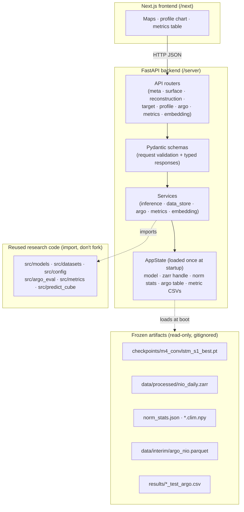
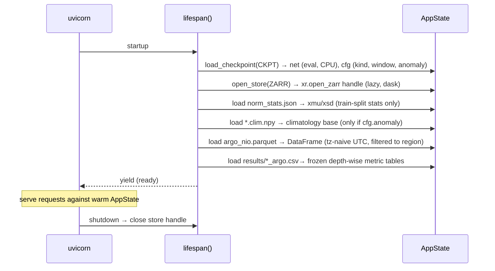

# OceanEmbed — FastAPI Backend (`/server`)

The inference and data API that powers the OceanEmbed demo. It turns the frozen
research artifacts in this repo — the trained checkpoint, the processed Zarr store, and
the Argo evaluation set — into a small, fast, **offline** HTTP API that the Next.js
frontend (`/next`) consumes.

> **One-line role:** the frontend never touches PyTorch, xarray, or NetCDF. It asks this
> server for JSON — surface fields, reconstructed temperature maps, 0–1000 m profiles,
> Argo overlays, and skill metrics — and this server is the *only* thing that loads the
> model and the ocean data.

This README is the **architecture contract** for the backend. It is written before the
code so the folder layout, the endpoints, and the data contracts are agreed first — the
same discipline the Zarr tensor contract got in `docs/06`.

---

## 1. Design principles (non-negotiable)

These fall straight out of `CLAUDE.md §9`, `docs/06`, and the methodology rules.

1. **Fully offline at demo time.** No live data ingestion, no Copernicus/PO.DAAC calls,
   no internet. The server boots from a **frozen checkpoint + a precomputed Zarr + a
   precomputed Argo parquet** and serves entirely from those. Venue Wi-Fi always fails —
   this is a hard requirement, not a nicety.
2. **Reuse `src/`, never fork it.** The model definitions (`src/models/unet.py`), the
   dataset/normalisation logic (`src/datasets.py`), the constants (`src/config.py`), the
   Argo matcher (`src/argo_eval.py`), and the metrics (`src/metrics.py`) are the source of
   truth. The server imports them. If the research code changes, the API follows for free.
   **No temperature physics, no normalisation, and no grid maths are re-implemented here.**
3. **Argo is sacred (`CLAUDE.md` rule 3).** Argo is only ever *scored against* or
   *overlaid* — never an input, never a target. The `/argo` and `/profile` endpoints
   enforce this by construction: Argo data flows out to the client, never into the model.
4. **CPU-only, sub-second.** Inference is a CPU forward pass (<1 s for the full region).
   No GPU dependency in the serving path — the demo laptop has none.
5. **Stateless requests, warm artifacts.** The heavy objects (model weights, Zarr handle,
   norm stats, Argo table) load **once** at startup into app state. Each request is a pure
   read/compute against those; nothing is mutated. This makes the server trivially
   restartable and safe to run behind a single worker.
6. **Precompute what needs the pipeline; compute what a click can compute.** All surface
   inputs / targets for the demo date range already live in the Zarr (shipped). A
   reconstruction for a date is a cached forward pass. A profile at a clicked cell is a
   pure array index into that cached cube — computed live, instantly.
7. **Report against Argo, never GLORYS val loss (`CLAUDE.md §2b`).** The `/metrics`
   endpoint serves the frozen depth-wise Argo tables from `results/`. It never invents a
   blended "accuracy" number as the headline.

---

## 2. What the backend serves (mapped to the demo spec)

Every judge action in `CLAUDE.md §9` / `docs/06 §1` maps to exactly one endpoint:

| Judge action (demo requirement) | Endpoint | Source |
|---|---|---|
| 1. Pick region + date | `GET /api/v1/meta` | Zarr time axis, `config.py` bbox |
| 2. View the 7 surface input fields | `GET /api/v1/surface/{date}` | `Zarr.X` |
| 3. Pick a depth → reconstructed map | `GET /api/v1/reconstruction` | model forward pass (cached) |
| 3b. GLORYS side-by-side toggle | `GET /api/v1/target` | `Zarr.Y` |
| 4. Click a location → 0–1000 m profile | `GET /api/v1/profile` | reconstruction cube, indexed |
| 5. Overlay nearby held-out Argo | in `/profile` + `GET /api/v1/argo` | `argo_nio.parquet` |
| 6. RMSE / Bias / Correlation on screen | `GET /api/v1/metrics` + per-point in `/profile` | `results/*_argo.csv`, `src/metrics.py` |
| 7. (Flex) embedding visualisation | `GET /api/v1/embedding` | `net.embed()` latent → PCA-RGB |

---

## 3. High-level architecture



### Layering (strict, one direction)

```
routers/  →  services/  →  core (AppState + src/*)  →  artifacts on disk
schemas/  ↑ used by routers for validation + response typing
```

- **Routers** are thin: parse/validate params (via Pydantic), call one service method,
  return a typed schema. No numpy, no torch in routers.
- **Services** hold all the logic: forward passes, array slicing, Argo matching, PCA.
  They depend on `AppState` (the warm artifacts) and on `src/`.
- **Core** owns `AppState` and the startup wiring. It is the only layer that knows file
  paths and how to load checkpoints/Zarr.

---

## 4. Folder structure

```
server/
  README.md                     # this file — the architecture contract
  pyproject.toml                # deps + tooling (ruff, pytest) — or requirements.txt
  requirements.txt              # pinned, CPU-only torch
  .env.example                  # documented settings; copy to .env (gitignored)
  .gitignore
  Dockerfile                    # optional: reproducible offline image
  run.sh                        # uvicorn app.main:app --host 0.0.0.0 --port 8000

  app/
    __init__.py
    main.py                     # create_app(): FastAPI factory, CORS, router mount, lifespan
    config.py                   # Settings (pydantic-settings): paths, model choice, CORS origins
    lifespan.py                 # @asynccontextmanager: load artifacts → AppState → yield → close
    dependencies.py             # FastAPI DI: get_state(), get_inference(), get_data_store()...

    core/
      __init__.py
      state.py                  # AppState dataclass: model, zarr, stats, argo_df, metric_tables
      loader.py                 # load_checkpoint(), open_store(), load_argo(), load_metric_csvs()
      grid.py                   # thin wrappers over src.config: dates, crop offsets, lat/lon axes
      errors.py                 # AppError hierarchy + exception handlers (404/422/500 → JSON)

    api/
      __init__.py
      router.py                 # aggregates all route modules under /api/v1
      routes/
        __init__.py
        health.py               # GET /healthz, /readyz  (is the model loaded?)
        meta.py                 # GET /meta
        surface.py              # GET /surface/{date}, GET /surface/{date}/{channel}
        reconstruction.py       # GET /reconstruction
        target.py               # GET /target   (GLORYS ground truth for side-by-side)
        profile.py              # GET /profile
        argo.py                 # GET /argo
        metrics.py              # GET /metrics, GET /metrics/ablation
        embedding.py            # GET /embedding

    schemas/
      __init__.py
      common.py                 # Grid, BBox, FieldStats, ColorScale, PointModels
      meta.py                   # MetaResponse (dates, depths, channels, models, region)
      fields.py                 # Field2D (values, lat, lon, units, vmin/vmax), SurfaceResponse
      profile.py               # ProfileResponse (depths, pred, argo, per-depth metrics)
      metrics.py               # DepthMetricRow, MetricsResponse, AblationResponse
      embedding.py             # EmbeddingResponse (RGB image, explained variance)

    services/
      __init__.py
      inference.py              # ModelBundle: load net from ckpt cfg; predict_cube_for_date()
      data_store.py             # surface_field(), target_field(), available_dates(), land_mask()
      argo.py                   # nearby_profiles(), matched_profile_on_grid()
      metrics.py                # depthwise_table(), point_metrics(), ablation_curve()
      embedding.py              # latent_rgb(): net.embed(x) → PCA(3) → normalised RGB

    utils/
      __init__.py
      arrays.py                 # nan→null JSON encoding, optional downsample, float32→list
      cache.py                  # lru_cache / dict cache for per-(date,model) cubes
      colors.py                 # suggested vmin/vmax + colormap name per channel/depth (metadata only)

  scripts/
    warm_cache.py               # precompute + pickle reconstruction cubes for demo dates
    export_demo_bundle.py       # copy the minimal frozen artifacts into a portable bundle
    smoke.py                    # boot app in-process, hit every endpoint once, assert 200

  tests/
    conftest.py                 # spins a TestClient against a tiny fake Zarr (src.datasets._fake_store)
    test_health.py
    test_meta.py
    test_surface.py
    test_reconstruction.py
    test_profile.py
    test_argo.py
    test_metrics.py
    test_contracts.py           # response shapes match schemas; grid coords match src.config
```

**Why this shape:** it mirrors `src/`'s "small, boring, readable modules — no premature
abstraction" rule. Routers/services/schemas is the standard FastAPI split; `core` isolates
the only stateful, path-aware part (artifact loading) so tests can swap in a fake store.

---

## 5. Tech stack

| Concern | Choice | Why |
|---|---|---|
| Web framework | **FastAPI** | async, Pydantic v2 validation, auto OpenAPI docs at `/docs` |
| ASGI server | **uvicorn** (single worker) | artifacts are big + read-only; one warm worker is simplest and enough for a demo |
| Validation / typing | **Pydantic v2** + `pydantic-settings` | typed responses the frontend can codegen against; `.env`-driven config |
| Numerics | **numpy**, **xarray**, **zarr**, **netCDF4** | already the repo's data stack; the server reuses it, doesn't add to it |
| Model | **torch (CPU wheel)** | `+cpu` index — no CUDA in the serving image |
| Data reuse | `src/` on `sys.path` | import `MODELS`, `NIODataset`, `config`, `argo_eval`, `metrics` |
| Dev tooling | ruff + pytest | matches "small runnable scripts with self-checks" convention |

`server/requirements.txt` is the **serving subset** of the root `requirements.txt` — no
`copernicusmarine`, no `streamlit`, no `cartopy`. Add only: `fastapi`, `uvicorn[standard]`,
`pydantic-settings`, `python-multipart` (if needed), and the CPU torch pin.

```
# server/requirements.txt (sketch)
fastapi
uvicorn[standard]
pydantic-settings
numpy
xarray
zarr
netCDF4
scipy
--extra-index-url https://download.pytorch.org/whl/cpu
torch
```

---

## 6. Startup lifecycle (the warm-up)

All heavy loading happens once, in the `lifespan` context manager, before the server
accepts traffic. `readyz` returns 503 until this completes.



**Checkpoint contract** (from `src/predict_cube.py`): `torch.load(ckpt)` returns a dict
with `st["model"]` (state dict) and `st["cfg"]` where `cfg["model"]["kind"]` selects the
class from `MODELS = {"unet", "oceanembed", "temporal"}`, and `cfg["window"]` /
`cfg["anomaly"]` drive the dataset. The server **must** read `window` from the checkpoint
— M4 needs `[B, T, C, H, W]`; defaulting to 1 is a silent shape error.

Default served model: **`m4_convlstm`** (best, 0.890 ± 0.008 RMSE vs Argo). The server can
hold *multiple* checkpoints (M2/M3/M4) so the frontend can switch models and the ablation
view is real — see `SERVED_MODELS` in settings.

---

## 7. Data & grid contracts (the numbers the frontend can rely on)

Straight from `src/config.py` — the server exposes these via `/meta` so the frontend never
hardcodes them, but they are frozen:

| Quantity | Value |
|---|---|
| Region bbox | lat `0–25°N`, lon `55–100°E` |
| Native grid | `100 × 180` @ 0.25° (`LAT`, `LON` cell centres) |
| Model grid | `96 × 176` (centre crop, `dy=dx=2`) — reconstructions are on this crop |
| Channels (X) | `["sst","sss","sla","cur_u","cur_v","wind_u","wind_v"]` |
| Depths (Y) | `[0,5,10,20,30,50,75,100,125,150,200,300,500,700,1000]` m (15) |
| Report depths | `[0,50,100,200,500,1000]` m |
| Demo split | `test` = `2023-01-01 … 2024-12-31` |

**NaN is the mask.** Zarr `Y` is NaN on land/missing; reconstruction cubes are blanked on
land (`predict_cube` land-masking). The JSON encoder converts NaN → `null` so the frontend
can render land as transparent. **Never** send land pixels as `0.0` — that was the anomaly
model's 500 m disaster (`src/predict_cube.py` comment).

**Grid alignment for clicks.** A clicked (lat, lon) maps to the nearest model-grid cell
exactly as `src/argo_eval.py` does (`argmin` on the cropped `lat`/`lon`). The profile
endpoint reuses that indexing so a clicked profile and its Argo match come from the same
cell — no two-row drift.

---

## 8. API reference

Base path: `/api/v1`. Interactive docs auto-generated at `/docs` (Swagger) and `/redoc`.

All 2-D field payloads share the `Field2D` schema so the frontend has one renderer:

```jsonc
// Field2D
{
  "values": [[...], ...],     // 2-D array, row-major [lat][lon]; null = land/missing
  "lat": [ ... ],             // cell-centre latitudes  (ascending)
  "lon": [ ... ],             // cell-centre longitudes (ascending)
  "units": "degC",
  "vmin": 24.1, "vmax": 31.7, // suggested color scale (percentile-clipped)
  "colormap": "thermal"       // suggested Plotly/Deck colormap name (metadata only)
}
```

### `GET /meta`
Bootstrap payload for the frontend. Available dates, depth list, channel metadata (name,
long name, units), served models with their Argo blended RMSE, region bbox, and grid.
```jsonc
{
  "region": {"name": "Arabian Sea + Bay of Bengal",
             "bbox": {"lat_min":0,"lat_max":25,"lon_min":55,"lon_max":100}},
  "grid": {"model_shape":[96,176], "res_deg":0.25},
  "dates": ["2023-01-01", ...],           // days present in the served Zarr split
  "depths_m": [0,5,10,...,1000],
  "report_depths_m": [0,50,100,200,500,1000],
  "channels": [{"key":"sst","long_name":"Sea surface temperature","units":"degC"}, ...],
  "models": [{"key":"m4_convlstm","label":"M4 ConvLSTM","argo_rmse":0.890,
              "kind":"temporal","window":7,"is_default":true}, ...]
}
```

### `GET /surface/{date}`  ·  `GET /surface/{date}/{channel}`
The 7 surface input fields for a date (demo req. 2). Full form returns `{channel: Field2D}`
for all 7; the per-channel form returns one `Field2D` (lighter for lazy tabs). Read from
`Zarr.X`, on the native or model grid (query `?grid=model|native`, default `model`).

### `GET /reconstruction`
The headline map (demo req. 3). Query: `date` (required), `depth` (m, must be in `DEPTHS`),
`model` (default `m4_convlstm`). Runs the forward pass for that date (cached per
`(date, model)` — the whole 15-depth cube is produced once, then sliced by depth), returns
a `Field2D` in °C on the model grid, land = `null`.
- For M4 the service assembles the 7-day input window ending at `date` from the Zarr, exactly like `NIODataset(window=7)`.

### `GET /target`
GLORYS12 ground truth at a date/depth (demo req. 3b, side-by-side toggle). `Field2D` from
`Zarr.Y`. Labelled clearly as the *training target / reanalysis* — not truth — so the
"GLORYS has a +0.72 °C warm bias" honesty story (`CLAUDE.md §2b`) is tellable in the UI.

### `GET /profile`
Click-to-profile (demo req. 4–6). Query: `date`, `lat`, `lon`, `model`.
```jsonc
{
  "cell": {"lat": 15.125, "lon": 88.375},          // snapped model-grid cell
  "depths_m": [0,5,...,1000],
  "predicted": [29.8, 29.6, ..., 4.1],             // model, °C; null below valid range
  "target":    [30.5, 30.3, ..., 4.0],             // GLORYS at the cell (optional)
  "argo": {                                         // null if none within tolerance
    "profile_id": "...", "distance_km": 18.3, "days_off": 1,
    "obs_on_depths": [30.1, ..., null],            // Argo interp to SIH depths (argo_eval rule)
    "point_metrics": [{"depth_m":0,"rmse":0.5,"bias":-0.2,"corr":0.95}, ...]
  }
}
```
The Argo interpolation and acceptance rule (`max(0.1·z, 10 m)` gap, no extrapolation) are
`src/argo_eval.interp_profile` verbatim. Per-point metrics use `src/metrics.depthwise`.

### `GET /argo`
Nearby held-out Argo profiles for a date/point without running the model — for a map of
available floats. Returns id, lat/lon, time, distance. (Overlay data only; never model I/O.)

### `GET /metrics`  ·  `GET /metrics/ablation`
Depth-wise skill (demo req. 6, `docs/06` Tab 4). `/metrics?model=` serves the frozen
`results/<run>_test_argo.csv` as typed rows (`depth_m, n, rmse, mae, bias, corr, r2`).
`/metrics/ablation` returns the RMSE-vs-depth curve for M0…M4 **plus the GLORYS-target
ceiling row** — the single most important slide (`CLAUDE.md §12`). These are read from
`results/`, never recomputed at request time.

### `GET /embedding`
Optional flex (demo req. 7). Runs `net.embed(x)` for a date, PCA-reduces the
`[256, 12, 22]` bottleneck latent to 3 components, min-max normalises to an RGB image, and
returns it plus explained-variance ratios. This literally visualises "what OceanEmbed
learned."

### `GET /healthz` · `GET /readyz`
Liveness (process up) and readiness (artifacts loaded). Frontend gates its splash screen
on `readyz`.

---

## 9. Caching strategy

| Layer | What | Policy |
|---|---|---|
| Startup | model, stats, argo table, metric CSVs | loaded once into `AppState` |
| Zarr | `xr.open_zarr` handle | lazy/dask; slices read on demand, OS page cache warms |
| Reconstruction cubes | per `(date, model)` full 15-depth cube | `lru_cache`(maxsize ≈ demo dates × models); a depth/profile request is then a pure slice |
| Optional cold-start | `scripts/warm_cache.py` | pre-materialises cubes for the scripted 90-s demo dates so the *first* click is also instant |

Because a whole cube is cached on the first `/reconstruction` for a date, the subsequent
`/profile` and other-depth requests for that date cost nothing but an array index — which
is exactly the "compute what a click can compute" rule.

---

## 10. Configuration (`app/config.py`, via `.env`)

`pydantic-settings` reads these; `.env` is gitignored. Paths default to the repo's real
locations so it "just works" from a checkout.

```env
# server/.env.example
OCEANEMBED_ZARR=../data/processed/nio_daily.zarr
OCEANEMBED_ARGO=../data/interim/argo_nio.parquet
OCEANEMBED_RESULTS=../results
OCEANEMBED_CHECKPOINTS=../checkpoints
OCEANEMBED_DEFAULT_MODEL=m4_convlstm
# comma-separated run names to load; each maps to <CHECKPOINTS>/<run>_s1_best.pt
OCEANEMBED_SERVED_MODELS=m4_convlstm,m2_unet,m3_oceanembed
OCEANEMBED_SPLIT=test
OCEANEMBED_CORS_ORIGINS=http://localhost:3000
OCEANEMBED_DEVICE=cpu
```

**CORS:** the only origin needed is the Next.js dev/prod URL. Locked down via
`CORSMiddleware` to `OCEANEMBED_CORS_ORIGINS` — no `*` in anything shippable.

---

## 11. Error handling

A small `AppError` hierarchy in `core/errors.py`, mapped to JSON by exception handlers:

| Case | Status | Body |
|---|---|---|
| Date not in served split | 404 | `{"detail":"date 2019-06-01 not in test split (2023-01-01..2024-12-31)"}` |
| Depth not in `DEPTHS` | 422 | lists valid depths |
| Point outside region bbox | 422 | echoes the bbox |
| Unknown model key | 404 | lists `SERVED_MODELS` |
| Artifacts missing at boot | 503 on `/readyz` | names the missing file + how to build it |

Pydantic handles the rest of param validation automatically (422 with field detail).

---

## 12. Testing

- `tests/conftest.py` builds a **tiny fake Zarr** with `src.datasets._fake_store` (the same
  helper the research self-checks use), fits stats, and constructs a `TestClient` — so the
  suite runs with **no real data and no GPU**, in CI, in seconds.
- `test_contracts.py` asserts the invariants the frontend depends on: `Field2D.lat/lon`
  match `src.config` cropped axes; land cells serialise as `null`; depth lists equal
  `DEPTHS`; `/meta` model RMSEs match the frozen numbers.
- `scripts/smoke.py` boots the app against the *real* artifacts and hits every endpoint
  once — the "one end-to-end request" integration gate, mirroring `docs/06`'s "one
  end-to-end train step" idea.

Follow the repo convention: prefer small runnable scripts with `if __name__ == "__main__"`
self-checks; pytest is the harness, not a reason to over-abstract.

---

## 13. Running it

```bash
# from repo root
cd server
python -m venv .venv && source .venv/bin/activate
pip install -r requirements.txt

# point it at the frozen artifacts (or rely on .env defaults)
cp .env.example .env

# dev
uvicorn app.main:app --reload --port 8000
# → http://localhost:8000/docs   (Swagger)   ·   /api/v1/meta

# demo (single warm worker, no reload)
./run.sh            # uvicorn app.main:app --host 0.0.0.0 --port 8000
```

The frontend in `/next` points at `http://localhost:8000/api/v1`.

---

## 14. Deployment notes

- **Offline bundle:** `scripts/export_demo_bundle.py` copies the minimal set — one
  checkpoint, the `test`-split slice of the Zarr, `norm_stats.json`, `argo_nio.parquet`,
  and the `results/*_argo.csv` — into a portable folder so the demo runs from a checkout on
  a clean, disconnected laptop (`docs/06` risk row: "runs CPU-only from a checkout").
- **Docker (optional):** CPU torch base image, copy `src/` + `server/` + the frozen bundle,
  `CMD uvicorn`. Keep it single-stage and boring.
- **Do not** put any Copernicus/PO.DAAC/argopy credential or client in the serving image.
  The server reads pre-built files only; live download stays in `src/download/`.

---

## 15. Boundaries (what this backend does *not* do)

- No training, no downloading, no regridding — that is `src/` and the offline pipeline.
- No writing to the Zarr, checkpoints, or results — **read-only** over all artifacts.
- No Argo ingested as model input/target, ever, in any endpoint.
- No live/real-time data, no 3-D web engine, no global model — all out of scope per
  `CLAUDE.md §10`.

---

*Next: the frontend contract in `/next/README.md` consumes exactly the schemas in §8.
Agree §7 (grid/data contract) and §8 (endpoints) before either side writes code — same
rule that made the Zarr tensor contract the team interface.*
